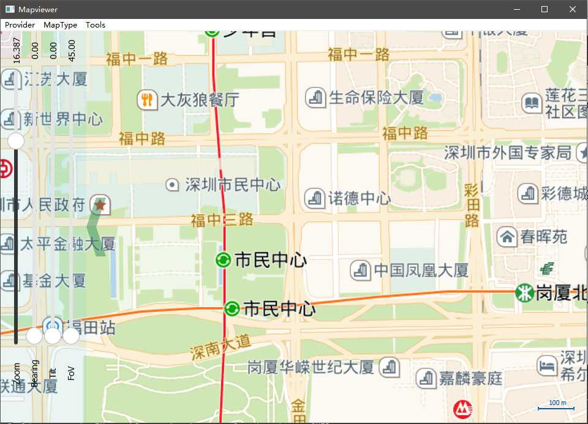
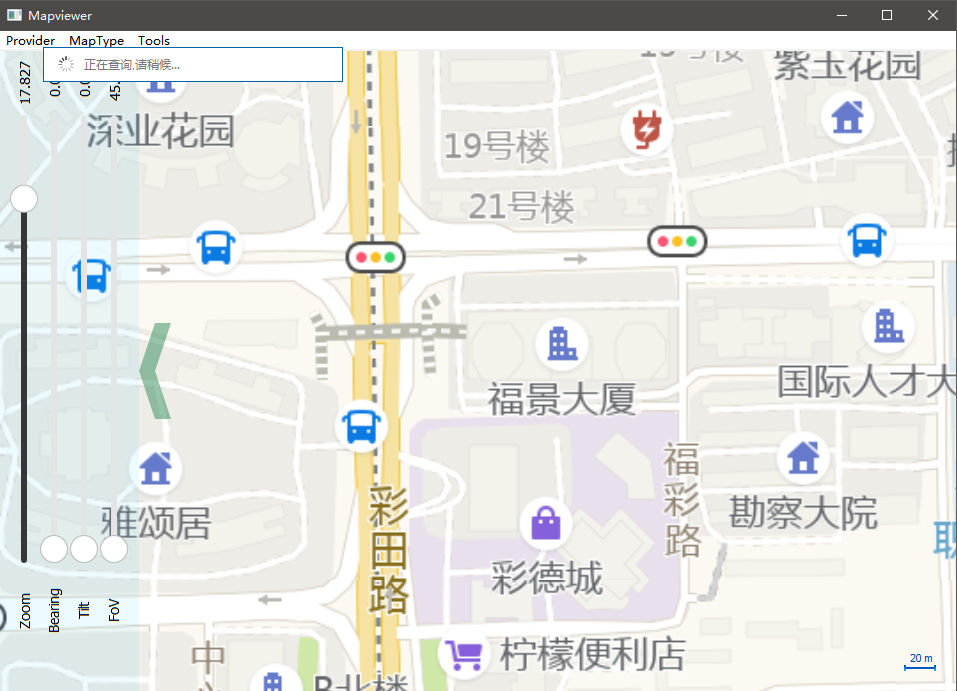
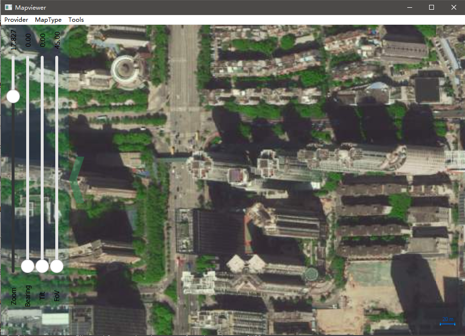

# Amap Maps plugin for QtLocation
## 高德地图Qt插件 plugin for QtLocation module
* Qt地图插件，使用简单方便，不用浏览器内核，运行高效迅猛；
* 跨平台支持，（Qt Windows（MinGW, VS），Linux(桌面、嵌入式)， Android， ios, qnx都可以的而且测试过）；
* 在线更新下载，支持离线地图；
* 由于我国家安全，GPS定位数据是加密过的，加入纠偏算法会有2m左右误差，精度要求高可以使用高德api进行在线纠偏；
* 经过测试的最新支持Qt5.15.0；

## 编译工程
1.将在生成目录编译出插件（以使用MinGW为例子）
```
	plugins\geoservices\qtgeoservices_amap.dll 
	plugins\geoservices\qtgeoservices_amapd.dll
```

2.将（qtgeoservices_amap.dll 、qtgeoservices_amapd.dll）拷贝插件到Qt的 plugins\geoservices 定位插件目录
```
	C:\Qt\Qt5.13.2\5.13.2\mingw53_32\plugins\geoservices
```
## 配合使用QML建立地图（example目录的测试工程）
```
	import QtQuick 2.12
	import QtQuick.Window 2.12
	import QtPositioning 5.12
	import QtLocation 5.12

	Window {
		visible: true
		width: 640
		height: 480
		title: qsTr("Hello World")

		Map{
			anchors.fill:parent
			plugin: Plugin{name: "amap"}
		}
	}
```
MapType:街景

MapType:室内

MapType:卫星

