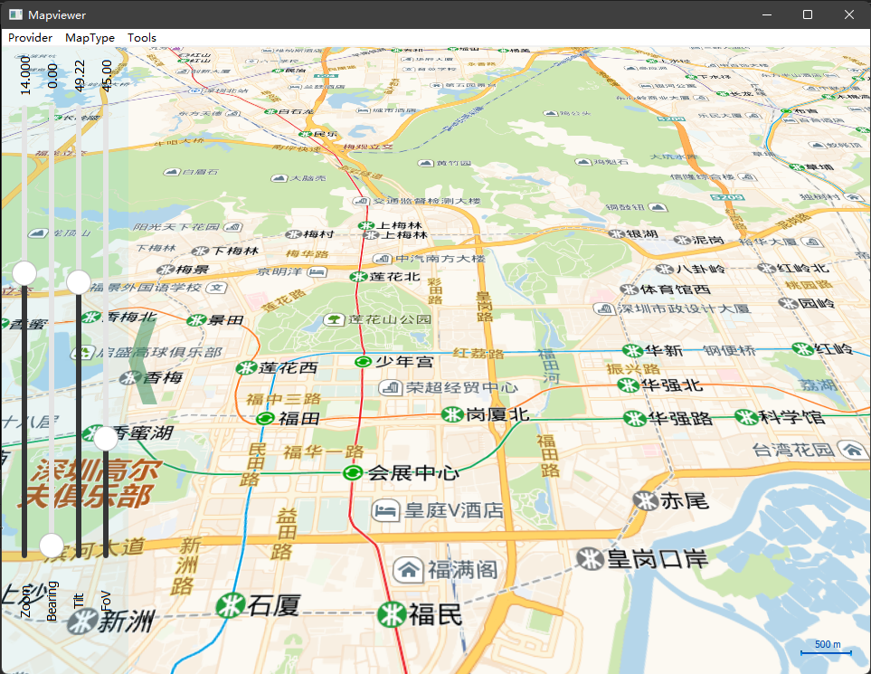
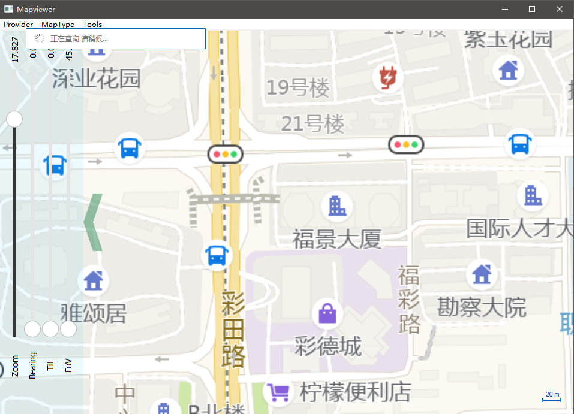
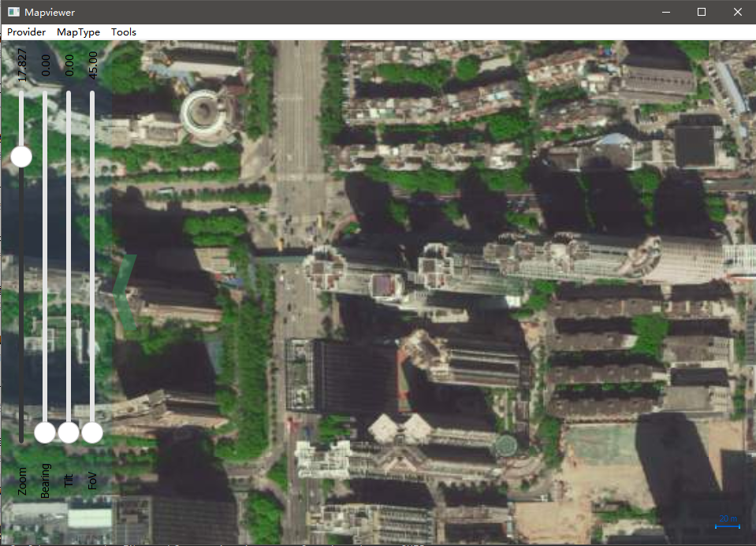
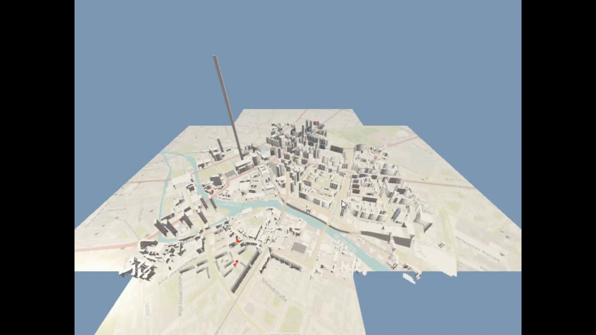

# Amap Maps plugin for QtLocation[Support Qt5、Qt6]

## 高德地图Qt插件 plugin for QtLocation module
* Qt地图插件，使用简单方便，不用浏览器内核，运行高效迅猛；
* 跨平台支持，（Qt Windows（MinGW, MSVC）\Linux(桌面、嵌入式)\Android\IOS\QNX都可以的亲测试过）,鸿蒙（还没试过）；
* 在线更新下载，支持离线地图；
* 支持地图倾斜、旋转、方位调整等；

## 编译工程
1.将在生成目录编译出插件（以使用MinGW为例子）
```
	plugins\geoservices\qtgeoservices_amap.dll 
	plugins\geoservices\qtgeoservices_amapd.dll
```

2.将（qtgeoservices_amap.dll 、qtgeoservices_amapd.dll）拷贝插件到Qt的 plugins\geoservices 定位插件目录
注意：以下路径是以使用MinGW为例子
```
	C:\Qt\Qt5.13.2\5.13.2\mingw53_32\plugins\geoservices
```
## 接下来就可以非常容易的使用，QML建立地图高德地图（example目录的测试工程）
```
	import QtQuick 2.12
	import QtQuick.Window 2.12
	import QtPositioning 5.12
	import QtLocation 5.12

	Window {
		visible: true
		width: 640
		height: 480
		title: qsTr("Hello AMap")

		Map{
			anchors.fill:parent
			plugin: Plugin{
				name: "amap"
			}
		}
	}
```
MapType:街景

MapType:室内

MapType:卫星


3D矢量地图以及overlay模型展示


